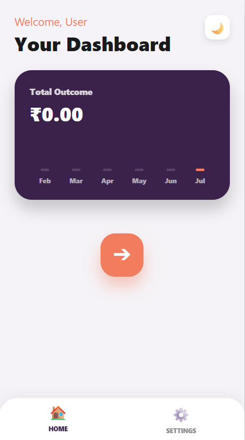
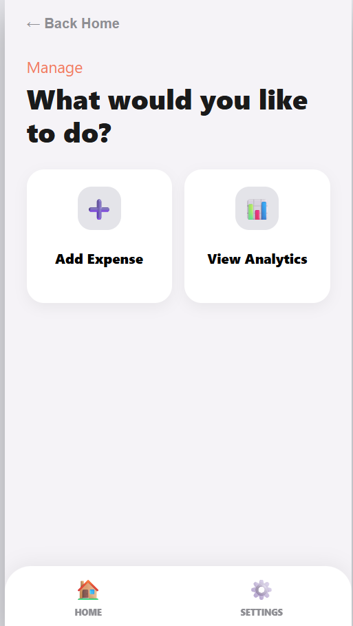
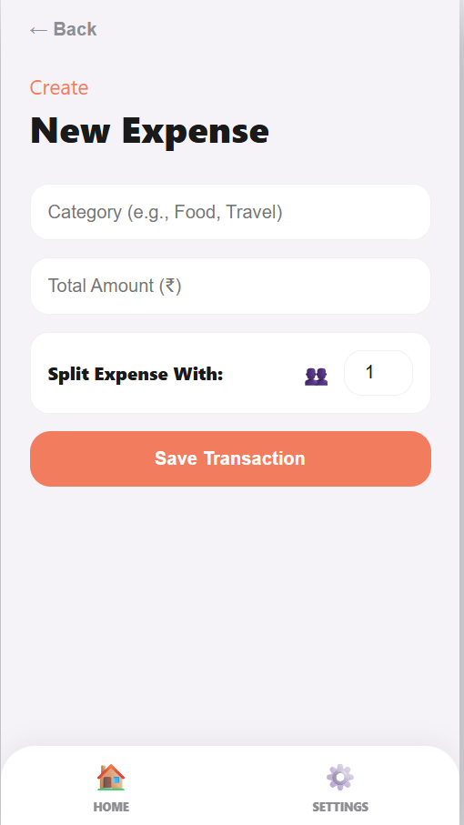
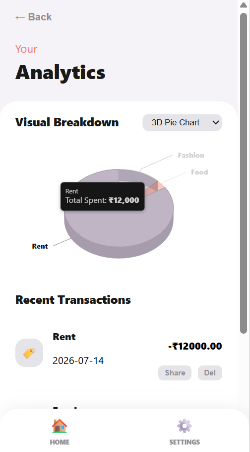

# 💸 Serverless Expense Tracker

A blazing-fast, modern financial dashboard built entirely with HTML, CSS, and vanilla JavaScript. This project demonstrates modern frontend state management, utilizing the browser's LocalStorage to save data securely without needing a backend server.

### 🔴 [Click Here to View the Live App](https://adi-tech-01.github.io/Expense-Tracker_Web/)

---

## 📸 App Preview
---
## Home Screen

---
## Manage 

---
## New Expense

---
## Analytics


---

## 🚀 Key Features
* **Zero Backend Required:** Runs entirely in the browser using JavaScript and LocalStorage. Works offline!
* **3D Visual Analytics:** Interactive Pie and Bar charts powered by Highcharts.
* **Dynamic UI:** Smooth, mobile-first design with a dark/light mode toggle.
* **Financial Tools:** Built-in bill splitting and transaction management (CRUD).
* **Social Connectivity:** Native sharing features to export expense details to WhatsApp or Messages.

## 🛠️ Tech Stack & Architecture
* **Frontend:** HTML5, CSS3, JavaScript (ES6+)
* **Architecture:** Client-Side Rendering (CSR), MVC File Structure
* **Database:** Browser LocalStorage API
* **Visualization:** Highcharts 3D Engine

## 💻 How to Run Locally
Because this app is completely serverless, you do not need to install Python, Node, or any dependencies. 

1. Clone the repository to your machine:
   ```bash
   git clone [https://github.com/YOUR_USERNAME/Expense-Tracker-Web.git](https://github.com/YOUR_USERNAME/Expense-Tracker-Web.git)